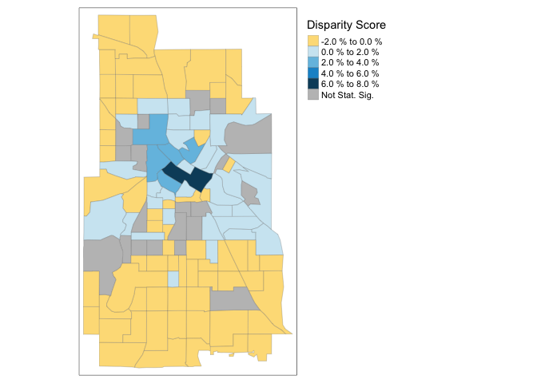

<!-- README.md is generated from README.Rmd. Please edit that file -->

# sedtR

<!-- badges: start -->

[](https://lifecycle.r-lib.org/articles/stages.html#experimental)
[](https://www.gnu.org/licenses/gpl-3.0)
<!-- badges: end -->

### Purpose of `sedtR`

The `sedtR` package to allow R programmers to easily interact with
Urban’s [Spatial Equity Data
Tool](https://apps.urban.org/features/equity-data-tool/) (SEDT)
application programming interface (API).

## Background

### What is the Spatial Equity Data Tool?

The SEDT enables local, state, and federal leaders, as well as the
general public, to upload their own point spatial data and quickly
assess whether place-based programs and resources – such as parks,
libraries, wi-fi hotspots or electric vehicle charging stations – are
equitably distributed across neighborhoods and demographic groups.

The tool – launched in 2020 and expanded in 2021 – has been used by a
wide variety of experts and nonexperts alike to assess equity in the
distribution of local programs and resources. For example, the
Bloomington Pedestrian and Bicycle Safety Commission analyzed sidewalk
funding allocations, and advocates in Cincinnati identified economic and
racial inequities in car crash locations.

### Why Create a Public API and `sedtR`?

Through engagements with local government and nonprofit users, we
identified a key barrier. Organizations wanted to embed the SEDT within
their own tools and data workflows and thus make the Tool a core part of
institutional processes. However, before the API’s release in March
2024, Tool users would have had to visit Urban’s website and use the GUI
interface to upload one dataset at a time whenever new analyses were
needed.

The release of the API overcomes this barrier by allowing programmatic
access to the Tool. We wrote `sedtR` to wrap the public API’s endpoints
in user-friendly R code. We are hopeful that `sedtR` makes it easy for
researchers, analysts, and policymakers to incorporate SEDT calculations
into R workflows.

## Installation

You can install the development version of sedtR from
[GitHub](https://github.com/) with:

``` r
# install.packages("devtools")
devtools::install_github("UrbanInstitute/sedtR")
```

## Example

The following example illustrates using the `call_sedt_api()` function
on Minneapolis, MN bikeshare data stored on the Urban Institute’s [Data
Catalog](https://datacatalog.urban.org/).

``` r
library(sedtR)
#> Loading sedtR - using the production API

withr::with_tempdir({
  #download bicycle data:
download.file(
  "https://equity-tool-api.urban.org/sample-data/minneapolis_bikes.csv",
  destfile = "bikes.csv")

#call sedt API with wrapper function
sedt_response <- sedtR::call_sedt_api(
  resource_file_path = here::here("bikes.csv"),
  resource_lat_column = "lat",
  resource_lon_column = "lon",
  geo = "city",
  acs_data_year = "2021")
})
#> No encoding supplied: defaulting to UTF-8.
#> No encoding supplied: defaulting to UTF-8.
#> No encoding supplied: defaulting to UTF-8.
#> No encoding supplied: defaulting to UTF-8.
#> No encoding supplied: defaulting to UTF-8.
#> [1] "getting output file"
#> No encoding supplied: defaulting to UTF-8.
```

`call_sedt_api()` returns a list object contains a `sf` object that can
be visualized using `create_map()`:

``` r
create_map(sedt_response$geo_bias_data, save_map = FALSE)
```



A data frame with demographic information used in the analysis is also
returned:

``` r
sedt_response$demo_bias_data
#>                           census_var data_value summary_value diff_data_city
#> 1                    pct_no_internet    8.78435         7.752        1.03235
#> 2         pct_under_200_poverty_line   37.70731        33.240        4.46731
#> 3                pct_all_other_races    6.23852         6.280       -0.04148
#> 4                pct_less_hs_diploma   10.10677         9.295        0.81177
#> 5                  pct_under18_unins    4.50332         3.074        1.42932
#> 6                    pct_under18_pov   19.22721        21.193       -1.96579
#> 7             pct_under18_disability    4.31995         4.882       -0.56205
#> 8            pct_under18_white_alone   36.54806        41.492       -4.94394
#> 9            pct_under18_black_alone   32.97229        30.788        2.18429
#> 10           pct_under18_asian_alone    6.53558         4.951        1.58458
#> 11                  pct_under18_hisp   13.67276        17.267       -3.59424
#> 12 pct_under18_all_other_races_alone   22.93145        22.769        0.16245
#> 13        pct_under18_limited_eng_hh    8.01230         9.349       -1.33670
#> 14                  pct_pov_children   15.36556        24.606       -9.24044
#> 15                   pct_pov_seniors   12.93859         8.065        4.87359
#> 16               pct_pov_white_alone   49.88414        39.334       10.55014
#> 17               pct_pov_black_alone   30.82189        38.261       -7.43911
#> 18               pct_pov_asian_alone    7.10258         6.253        0.84958
#> 19                      pct_pov_hisp    6.61893        10.454       -3.83507
#> 20                      pct_pov_bach   29.48083        19.405       10.07583
#> 21              pct_pov_less_than_hs   17.84389        27.908      -10.06411
#> 22                pct_pov_unemployed   20.22115        19.745        0.47615
#> 23                  pct_pov_veterans    4.23025         2.861        1.36925
#> 24                pct_pov_disability   23.07845        21.359        1.71945
#> 25                     pct_pov_unins    9.40374         8.424        0.97974
#> 26     pct_pov_all_other_races_alone   12.19148        16.152       -3.96052
#> 27                         pct_black   19.37671        18.213        1.16371
#> 28                         pct_white   58.73595        60.073       -1.33705
#> 29                         pct_asian    6.97013         5.601        1.36913
#> 30                          pct_hisp    8.68658         9.832       -1.14542
#> 31                      pct_children   15.33392        19.734       -4.40008
#> 32                       pct_seniors   10.30962        10.183        0.12662
#> 33                      pct_veterans    3.59873         3.654       -0.05527
#> 34                         pct_unins    6.47823         6.147        0.33123
#> 35                    pct_disability   11.71519        11.006        0.70919
#> 36                       pct_renters   64.97899        51.936       13.04299
#> 37                pct_limited_eng_hh    5.57089         4.925        0.64589
#> 38                          pct_bach   31.92228        31.746        0.17628
#> 39            pct_under_poverty_line   21.61443        17.027        4.58743
#> 40                  pct_cb_renter_hh   35.34203        35.942       -0.59997
#> 41                         pct_unemp    5.98937         5.624        0.36537
#>    data_value_sd summary_value_margin sig_diff  geo geo_fips     geo_display
#> 1        0.54109                0.508    FALSE city  2743000 Minneapolis, MN
#> 2        0.74891                0.955     TRUE city  2743000 Minneapolis, MN
#> 3        0.32612                0.395    FALSE city  2743000 Minneapolis, MN
#> 4        0.62023                0.532    FALSE city  2743000 Minneapolis, MN
#> 5        1.49243                0.495    FALSE city  2743000 Minneapolis, MN
#> 6        2.10830                1.697    FALSE city  2743000 Minneapolis, MN
#> 7        0.77004                0.692    FALSE city  2743000 Minneapolis, MN
#> 8        2.20083                0.935     TRUE city  2743000 Minneapolis, MN
#> 9        2.20357                1.471    FALSE city  2743000 Minneapolis, MN
#> 10       1.27801                0.532    FALSE city  2743000 Minneapolis, MN
#> 11       1.43581                1.182    FALSE city  2743000 Minneapolis, MN
#> 12       1.89577                1.237    FALSE city  2743000 Minneapolis, MN
#> 13       1.82605                1.690    FALSE city  2743000 Minneapolis, MN
#> 14       1.15044                2.598     TRUE city  2743000 Minneapolis, MN
#> 15       1.30532                0.746     TRUE city  2743000 Minneapolis, MN
#> 16       2.80928                0.930     TRUE city  2743000 Minneapolis, MN
#> 17       1.74627                3.219     TRUE city  2743000 Minneapolis, MN
#> 18       1.00077                0.908    FALSE city  2743000 Minneapolis, MN
#> 19       0.83831                1.600     TRUE city  2743000 Minneapolis, MN
#> 20       2.15559                1.401     TRUE city  2743000 Minneapolis, MN
#> 21       1.37517                2.378     TRUE city  2743000 Minneapolis, MN
#> 22       2.00394                2.362    FALSE city  2743000 Minneapolis, MN
#> 23       1.10728                0.705    FALSE city  2743000 Minneapolis, MN
#> 24       1.32205                1.071    FALSE city  2743000 Minneapolis, MN
#> 25       0.97177                0.973    FALSE city  2743000 Minneapolis, MN
#> 26       1.01236                1.860    FALSE city  2743000 Minneapolis, MN
#> 27       0.59730                0.823    FALSE city  2743000 Minneapolis, MN
#> 28       0.66423                0.535    FALSE city  2743000 Minneapolis, MN
#> 29       0.36618                0.400     TRUE city  2743000 Minneapolis, MN
#> 30       0.43904                0.637    FALSE city  2743000 Minneapolis, MN
#> 31       0.40066                0.590     TRUE city  2743000 Minneapolis, MN
#> 32       0.36199                0.280    FALSE city  2743000 Minneapolis, MN
#> 33       0.24141                0.241    FALSE city  2743000 Minneapolis, MN
#> 34       0.29662                0.375    FALSE city  2743000 Minneapolis, MN
#> 35       0.39128                0.400    FALSE city  2743000 Minneapolis, MN
#> 36       0.63059                0.779     TRUE city  2743000 Minneapolis, MN
#> 37       0.37337                0.425    FALSE city  2743000 Minneapolis, MN
#> 38       0.81277                0.637    FALSE city  2743000 Minneapolis, MN
#> 39       0.71518                0.802     TRUE city  2743000 Minneapolis, MN
#> 40       1.04025                1.264    FALSE city  2743000 Minneapolis, MN
#> 41       0.32665                0.378    FALSE city  2743000 Minneapolis, MN
#>    geo_mo baseline_pop
#> 1    null    total_pop
#> 2    null    total_pop
#> 3    null    total_pop
#> 4    null    total_pop
#> 5    null  under18_pop
#> 6    null  under18_pop
#> 7    null  under18_pop
#> 8    null  under18_pop
#> 9    null  under18_pop
#> 10   null  under18_pop
#> 11   null  under18_pop
#> 12   null  under18_pop
#> 13   null  under18_pop
#> 14   null      pov_pop
#> 15   null      pov_pop
#> 16   null      pov_pop
#> 17   null      pov_pop
#> 18   null      pov_pop
#> 19   null      pov_pop
#> 20   null      pov_pop
#> 21   null      pov_pop
#> 22   null      pov_pop
#> 23   null      pov_pop
#> 24   null      pov_pop
#> 25   null      pov_pop
#> 26   null      pov_pop
#> 27   null    total_pop
#> 28   null    total_pop
#> 29   null    total_pop
#> 30   null    total_pop
#> 31   null    total_pop
#> 32   null    total_pop
#> 33   null    total_pop
#> 34   null    total_pop
#> 35   null    total_pop
#> 36   null    total_pop
#> 37   null    total_pop
#> 38   null    total_pop
#> 39   null    total_pop
#> 40   null    total_pop
#> 41   null    total_pop
```

## Where Can I Learn More?

The Spatial Equity Data Tool has comprehensive documentation in the form
of an [online book](https://ui-research.github.io/sedt_documentation/).
Most notably, there is a chapter [specifically devoted to the
API](https://ui-research.github.io/sedt_documentation/api_documentation.html).
It provides more in-depth `sedtR` code and outputs.

Other particularly relevant chapters cover [common API errors and
warnings](https://ui-research.github.io/sedt_documentation/common_errors_warnings.html),
[how to interpret Tool
results](https://ui-research.github.io/sedt_documentation/interpreting_results.html),
and a [description of data appropriate for the
Tool](https://ui-research.github.io/sedt_documentation/resource_datasets.html).

## Feedback

Please provide feedback by opening [GitHub
Issues](https://github.com/UrbanInstitute/sedtR/issues) or contacting us
at <sedt@urban.org>.
