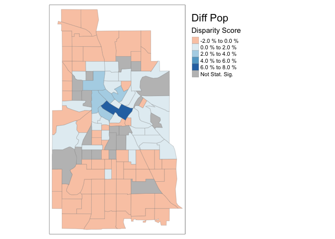

<!-- README.md is generated from README.Rmd. Please edit that file -->

# sedtR

<!-- badges: start -->

[](https://lifecycle.r-lib.org/articles/stages.html#experimental)
[](https://www.gnu.org/licenses/gpl-3.0)
<!-- badges: end -->

### Purpose of `sedtR`:

The `sedtR` package allows R programmers to easily interact with Urban’s
[Spatial Equity Data
Tool](https://apps.urban.org/features/equity-data-tool/) (SEDT) [public
application programming
interface](https://ui-research.github.io/sedt_documentation/api_documentation.html)
(API).

## Background

### What is the Spatial Equity Data Tool?

The SEDT enables local, state, and federal leaders, as well as the
general public, to upload their own point spatial data and quickly
assess whether place-based programs and resources – such as parks,
libraries, wi-fi hotspots or electric vehicle charging stations – are
equitably distributed across neighborhoods and demographic groups.

The tool – launched in 2020 and expanded in 2021 – has been used by a
wide variety of experts and nonexperts alike to assess equity in the
distribution of local programs and resources. For example, the
Bloomington Pedestrian and Bicycle Safety Commission analyzed sidewalk
funding allocations, and advocates in Cincinnati identified economic and
racial inequities in car crash locations.

### Why Create a Public API and `sedtR`:

Through engagements with local government and nonprofit users, we
identified a key barrier. Organizations wanted to embed the SEDT within
their own tools and data workflows and thus make the Tool a core part of
institutional processes. However, before the API’s release in March of
2024, Tool users would have had to visit Urban’s website and use the GUI
interface to upload one dataset at a time whenever new analyses were
needed. The release of the API overcomes this barrier by allowing
programmatic access to the Tool. We wrote `sedtR` to wrap the public
API’s endpoints in user-friendly R code. We are hopeful that `sedtR`
makes it easy for researchers, analysts, and policymakers to incorporate
SEDT calculations into R workflows.

The SEDT enables local, state, and federal leaders, as well as the
general public, to upload their own point spatial data and quickly
assess whether place-based programs and resources – such as parks,
libraries, wi-fi hotspots or electric vehicle charging stations – are
equitably distributed across neighborhoods and demographic groups.

## Installation

You can install the development version of sedtR from
[GitHub](https://github.com/) with:

``` r
# install.packages("devtools")
devtools::install_github("UrbanInstitute/sedtR")
```

## Example

The following example illustrates using the `call_sedt_api()` function
on Minneapolis, MN bikeshare data stored on the Urban Institute’s [Data
Catalog](https://datacatalog.urban.org/).

``` r
library(sedtR)
#> Loading sedtR - using the production API
```

``` r

# Call sedt API with wrapper function
sedt_response <- call_sedt_api(
  resource = "https://equity-tool-api.urban.org/sample-data/minneapolis_bikes.csv",
  geo = "city",
  acs_data_year = 2021
)
#> getting output file
```

A resource can be a path or URL for an existing delimited (`csv` or
`tsv`) file with coordinate columns, a spatial data file that can be
read with `sf::read_sf()`, a `sf` object, or a URL for a FeatureLayer.
Any input spatial data file or object *must* use POINT geometry.

`call_sedt_api()` returns a list object that contains a `sf` object
storing the geographic disparity scores:

``` r
sedt_response$geo_bias_data |>
  head()
#>   sig_diff_seniors data_prop diff_cb_renter_hh diff_pop prop_children
#> 1             TRUE   0.00000             0.000   -0.008       0.01043
#> 2            FALSE   0.00506            -0.004   -0.007       0.01378
#> 3             TRUE   0.00000            -0.002   -0.008       0.00746
#> 4             TRUE   0.00000            -0.003   -0.011       0.01193
#> 5             TRUE   0.00000             0.000   -0.008       0.00486
#> 6            FALSE   0.00253            -0.002   -0.002       0.00533
#>   diff_no_internet diff_under_200_poverty_line       GEOID diff_pov
#> 1           -0.006                      -0.008 27053000101   -0.003
#> 2           -0.008                      -0.010 27053000102   -0.005
#> 3           -0.007                      -0.006 27053000300   -0.007
#> 4           -0.007                      -0.009 27053000601   -0.005
#> 5           -0.006                      -0.002 27053000603   -0.002
#> 6            0.001                      -0.002 27053001100   -0.001
#>   diff_seniors diff_children prop_under_200_poverty_line prop_cb_renter_hh
#> 1       -0.007        -0.010                     0.00809           0.00049
#> 2       -0.004        -0.009                     0.01458           0.00937
#> 3       -0.008        -0.007                     0.00563           0.00158
#> 4       -0.015        -0.012                     0.00855           0.00316
#> 5       -0.007        -0.005                     0.00243           0.00024
#> 6        0.000        -0.002                     0.00517           0.00487
#>   prop_no_internet prop_pop
#> 1          0.00552  0.00786
#> 2          0.01252  0.01152
#> 3          0.00728  0.00753
#> 4          0.00735  0.01091
#> 5          0.00622  0.00761
#> 6          0.00198  0.00493
#>                                                                                                                                                                                                                                                                                                                                                                                                        geometry
#> 1                                                                                                                                                                         -93.31950, -93.31419, -93.30431, -93.29919, -93.29921, -93.29906, -93.30668, -93.31943, -93.31943, -93.31944, -93.31950, 45.05125, 45.05124, 45.05118, 45.05114, 45.04392, 45.03766, 45.03935, 45.04217, 45.04397, 45.04760, 45.05125
#> 2                                           -93.29919, -93.29409, -93.29153, -93.28223, -93.28083, -93.28343, -93.28321, -93.28270, -93.28673, -93.28811, -93.28811, -93.29041, -93.29403, -93.29489, -93.29906, -93.29921, -93.29919, 45.05114, 45.05113, 45.05113, 45.05116, 45.04357, 45.03536, 45.03345, 45.03243, 45.03151, 45.03151, 45.03272, 45.03473, 45.03646, 45.03674, 45.03766, 45.04392, 45.05114
#> 3                                                                                                                                                                                                                   -93.31879, -93.30856, -93.30848, -93.30833, -93.31343, -93.31853, -93.31862, -93.31870, -93.31879, 45.03546, 45.03545, 45.03132, 45.02409, 45.02410, 45.02409, 45.02772, 45.03134, 45.03546
#> 4 -93.26411, -93.26238, -93.26210, -93.25998, -93.25992, -93.24985, -93.24739, -93.24218, -93.23711, -93.23711, -93.23712, -93.23712, -93.23711, -93.24748, -93.24734, -93.26071, -93.26311, -93.26269, -93.26411, 45.02760, 45.02760, 45.02944, 45.03051, 45.03554, 45.03555, 45.03555, 45.03558, 45.03561, 45.02766, 45.02405, 45.02397, 45.02044, 45.02038, 45.01677, 45.01682, 45.01682, 45.02101, 45.02760
#> 5                                                                                                          -93.23712, -93.23711, -93.23711, -93.22693, -93.22690, -93.22690, -93.22688, -93.22687, -93.22686, -93.22686, -93.22961, -93.23328, -93.23712, -93.23712, 45.02405, 45.02766, 45.03561, 45.03567, 45.02773, 45.02771, 45.02410, 45.02047, 45.01951, 45.01892, 45.01922, 45.02226, 45.02397, 45.02405
#> 6                                                                                                                                                                                                                                        -93.24748, -93.23711, -93.23713, -93.23715, -93.24225, -93.24734, -93.24734, -93.24748, 45.02038, 45.02044, 45.01682, 45.01320, 45.01318, 45.01316, 45.01677, 45.02038
#>   prop_pov prop_seniors sig_diff_cb_renter_hh sig_diff_children sig_diff_pop
#> 1  0.00345      0.00684                 FALSE              TRUE         TRUE
#> 2  0.01036      0.00938                 FALSE              TRUE         TRUE
#> 3  0.00721      0.00799                 FALSE              TRUE         TRUE
#> 4  0.00515      0.01453                 FALSE              TRUE         TRUE
#> 5  0.00160      0.00700                 FALSE              TRUE         TRUE
#> 6  0.00384      0.00330                 FALSE             FALSE         TRUE
#>   sig_diff_no_internet sig_diff_pov                          disp_name
#> 1                FALSE        FALSE Census Tract 1.01, Minneapolis, MN
#> 2                FALSE        FALSE Census Tract 1.02, Minneapolis, MN
#> 3                FALSE         TRUE    Census Tract 3, Minneapolis, MN
#> 4                 TRUE         TRUE Census Tract 6.01, Minneapolis, MN
#> 5                 TRUE        FALSE Census Tract 6.03, Minneapolis, MN
#> 6                FALSE        FALSE   Census Tract 11, Minneapolis, MN
#>   sig_diff_under_200_poverty_line weighted_counts
#> 1                            TRUE               0
#> 2                            TRUE               2
#> 3                            TRUE               0
#> 4                            TRUE               0
#> 5                            TRUE               0
#> 6                           FALSE               1
```

A data frame with demographic information used in the analysis is also
returned:

``` r
sedt_response$demo_bias_data |>
  head()
#>                   census_var data_value summary_value diff_data_city
#> 1            pct_no_internet    8.78435         7.752        1.03235
#> 2 pct_under_200_poverty_line   37.70731        33.240        4.46731
#> 3        pct_all_other_races    6.23852         6.280       -0.04148
#> 4        pct_less_hs_diploma   10.10677         9.295        0.81177
#> 5          pct_under18_unins    4.50332         3.074        1.42932
#> 6            pct_under18_pov   19.22721        21.193       -1.96579
#>   data_value_sd summary_value_margin sig_diff  geo geo_fips     geo_display
#> 1       0.54109                0.508    FALSE city  2743000 Minneapolis, MN
#> 2       0.74891                0.955     TRUE city  2743000 Minneapolis, MN
#> 3       0.32612                0.395    FALSE city  2743000 Minneapolis, MN
#> 4       0.62023                0.532    FALSE city  2743000 Minneapolis, MN
#> 5       1.49243                0.495    FALSE city  2743000 Minneapolis, MN
#> 6       2.10830                1.697    FALSE city  2743000 Minneapolis, MN
#>   geo_mo baseline_pop
#> 1   null    total_pop
#> 2   null    total_pop
#> 3   null    total_pop
#> 4   null    total_pop
#> 5   null  under18_pop
#> 6   null  under18_pop
```

The package allows users to visualize the geographic disparity scores
and demographic disparity scores with `create_map()` and
`create_demo_chart()`, respectively. Like the interactive visualizations
on the \[SEDT website\]
(<https://apps.urban.org/features/equity-data-tool/>), these functions
allow users to visualize different geographic or demographic disparity
scores. `create_map()` allows interactive or static visualizations.

``` r
create_map(sedt_response$geo_bias_data, 
           interactive = FALSE, # optional, defaults to TRUE
           save_map = FALSE, #optional, defaults to FALSE. If TRUE, provide file_path
           col_to_plot = "diff_pop") #optional, default is "diff_pop"
#> tmap mode set to plotting
```



``` r
create_demo_chart(sedt_response$demo_bias_data,
                  group = "total", # optional, default is "total"
                  save_chart = FALSE) # optional, default is FALSE. If TRUE provide file_path
```


By default, these functions do not save the resulting images, but both
provide arguments (`save_map` and `save_chart`) which take logicals and
allow a user to save the outputted visualization.

## Where Can I Learn More:

The Spatial Equity Data Tool has comprehensive documentation in the form
of an [online book](https://ui-research.github.io/sedt_documentation/).
Most notably, there is a chapter [specifically devoted to the
API](https://ui-research.github.io/sedt_documentation/api_documentation.html).
It provides more in-depth `sedtR` code and outputs.

Other particularly relevant chapters cover [common API errors and
warnings](https://ui-research.github.io/sedt_documentation/common_errors_warnings.html),
[how to interpret Tool
results](https://ui-research.github.io/sedt_documentation/interpreting_results.html),
and a [description of data appropriate for the
Tool](https://ui-research.github.io/sedt_documentation/resource_datasets.html).

## Feedback:

Please provide feedback by opening [GitHub
Issues](https://github.com/UrbanInstitute/sedtR/issues) or contacting us
at <sedt@urban.org>.
